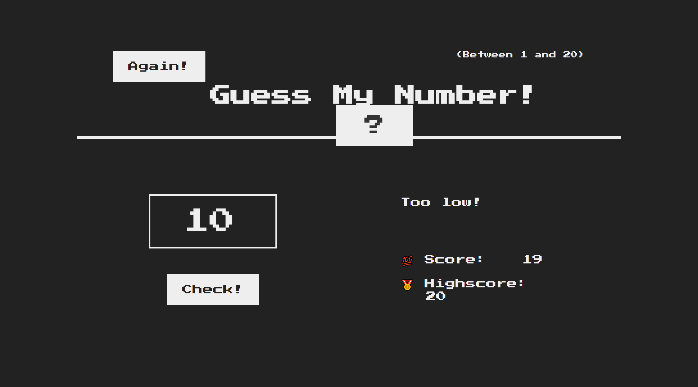
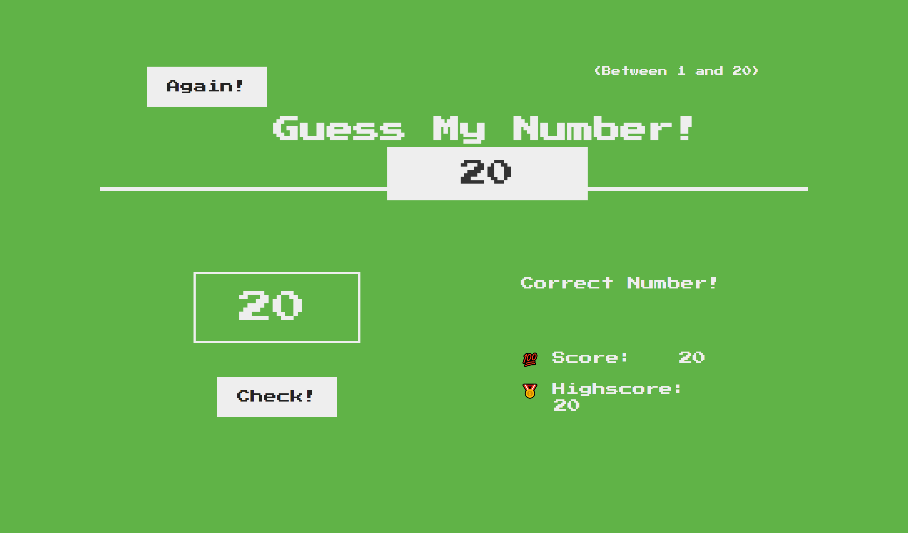

# Guess My Number 🎮

Welcome to Guess My Number, a simple game where you can test your guessing skills against the computer! Try to guess the randomly selected number between 1 and 20.

🔍 See the [demo](https://shakiba-vakili.github.io/guess-my-number/) in action!

## About the Game ℹ️

In Guess My Number, the computer chooses a random number, and it's your task to figure out what it is. Input your guess, and the game will let you know if you're too high, too low, or if you've guessed correctly!

## Credits 🙌

This project was inspired by the teachings of instructor Jonas Schmedtmann.

## Additional Resources 🚀

- **LinkedIn:** Let's connect for collaborations! [Shakiba Sadat Vakili](https://www.linkedin.com/in/shakiba-vakili/)
- **Email:** Reach out to me at [shakibvakili@gmail.com](mailto:shakibvakili@gmail.com) for any inquiries or collaborations.
- **GitHub:** Visit [@shakiba-vakili](https://github.com/shakiba-vakili) on GitHub for more projects and contributions.

Feel free to fork, contribute, or suggest improvements! Happy guessing! 🎉
